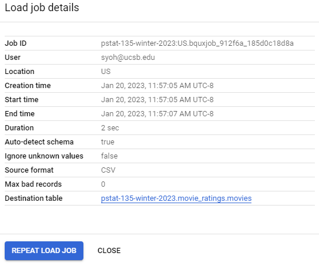
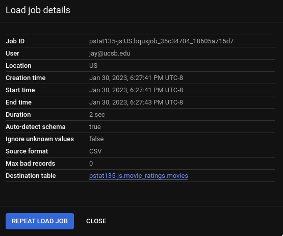

# Assignment 1
## PSTAT 135/235

### Name: Jay Singh
### Perm Number: 9825811


## MovieLens Dataset

In this assignment, we will be working on a new dataset. To download it paste the following URL into your laptop's browser: `http://files.grouplens.org/datasets/movielens/ml-latest.zip`. Alternatively, you can also go to `https://grouplens.org/datasets/movielens/` and download `ml-latest.zip`.

This dataset has around 27 million ratings on about 58,000 movies done by over 280,000 users and last updated on 9/2018. Unzip this 288 MB file. For the purpose of this assignment we will be using only two of the files that are included:

1. `movies.csv` (2.9 MB)
2. `ratings.csv` (760 MB).

## Question 1: Uploading Data to BigQuery

Upload these two files into a dataset in BigQuery and call it `movie_ratings`.

Create a new dataset and call it `movie_ratings`. We will load these two files into the newly created dataset two ways: using the web interface and agian using cloud shell.

### Question 1a: `movies` table

To create `movies` table from `movies.csv` file,

1. Download the zipped file
2. Unzip the archive
3. In your BigQuery interface, select in the resources list `<YOUR-PROJECT-ID>` > `movie_ratings` > click **"CREATE TABLE"** button
4. `Create table from`: `Upload`
    `Select file`: BROWSE and find `movies.csv` from your computer
    `Table`: `movies`
    Schema `Auto detect`: check

Find your LOAD job information from `PROJECT HISTORY` (next to `PERSONAL HISTORY`) at the bottom. Mine looks like @fig-job-info

{#fig-job-info}

Post screenshot of your LOAD job information here:

{#movies_upload}

### Question 1b: `ratings` table

Follow the same procedure as Question 1a to crate `ratings` table from `ratings.csv`. What happens?

The `ratings.csv` file is too large (over 100MB) to upload normally. Google Cloud suggests we use Cloud Storage for larger files.

**PSTAT 135 Students**: Upload `ratings.csv` file to Cloud Storage and create `ratings` table from it using the web interface. Then, post the screenshot of your LOAD job information here:

**Replace this text with your screenshot image**

**PSTAT 235 Students**: Upload `ratings.csv` file to Cloud Storage and create `ratings` table using the commmand line tools: `bq` and `gsutil`.

1. Verify the location of `ratings.csv` file using Cloud Storage command:

    ```bash
    gsutil ls gs://<YOUR-BUCKET-NAME>
    ```
    Note your the path to your `ratings.csv` file (referred to as `<RATINGS-FILE-LOCATION>` below).
2. Create an empty table with `bq`. Read the documentation, `bq mk --help` to fill-in the blanks in the code below:

    ```bash
    bq mk _______
    ```
3. Using `bq` command to load `movie_ratings.ratings` table with contents from  `<RATINGS-FILE-LOCATION>`. Read the documentation, `bq load --help` to fill-in the blanks in the code below:

    ```bash
    bq load --autodetect _______  _______
    ```

Replace the section below with your own commands:
```bash
gsutil ls gs://<YOUR-BUCKET-NAME>
bq mk _______
bq load --autodetect _______  _______
```

Also, post screenshot of your LOAD job information here:

**Replace this text with your screenshot image**


## Question 2: `ratings` table number of rows

How many rows are there in `ratings` table?

A. 27753445
B. 27000001
C. 27753444
D. 27000000

## Question 3: `movies` table number of rows

How many rows are there in the `movies` table?

A. 57999
B. 58000
C. 58097
D. 58098

## Question 3: number of unique movies

How many unique `movieId`'s are in `ratings` table?

A. 52019
B. Around 27 million
C. 53889
D. 58097

What is your SQL code to obtain the info?

## Question 4: highly rated movies

Which one of these movies are among top 10 highly rated movies, with at least
10,000 reviews? (select all that apply)

A. Star Wars: Episode IV - A New Hope (1977)
B. Chinatown (1974)
C. Godfather
D. Casablanca (1942)

What is your SQL code to obtain the info?

## Question 5: most watched movies

Which movie is the most watched? Make an assumption that number of ratings is
strongly correlated with number of people watching it.

A. Shawshank Redemption
B. Forrest Gump (1994)
C. Matrix
D. Toy Story (1995)

What is your SQL code to obtain the info?
